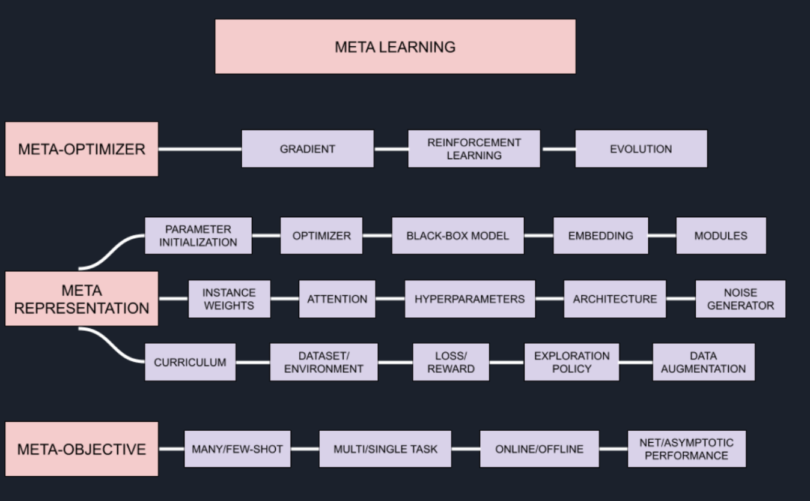
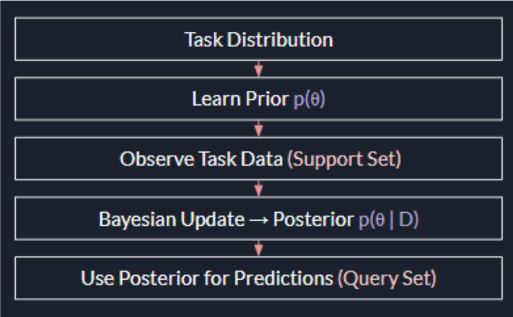
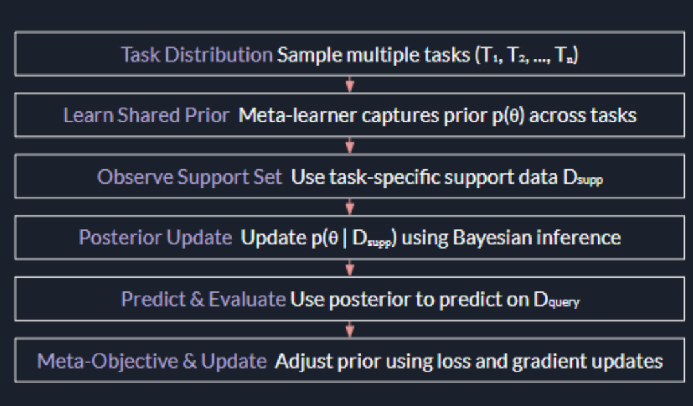

# Meta-Learning Meets Generation

## A Theory-Driven Approach to Few-Shot Intelligence

> Exploring how Meta-Learning and Generative Models can be combined to enable intelligent systems that learn effectively from limited data.

---

## Overview

Deep learning models typically require large amounts of labeled data to achieve high performance. However, many real-world domains such as healthcare, robotics, cybersecurity, and scientific research operate under severe data constraints.

This project investigates the intersection of **Meta-Learning** and **Generative Modeling**, focusing on how models can learn from a small number of examples while maintaining strong generalization capabilities.

The project explores:

* Model-Agnostic Meta-Learning (MAML)
* Few-Shot Learning
* Generative Adversarial Networks (GANs)
* Meta-Learning for Generative Models
* Bayesian Meta-Learning
* Generalization in Meta-Learning

---

# Problem Statement

Traditional machine learning models learn effectively only when large datasets are available.

```text
Large Dataset
      ↓
   Training
      ↓
Trained Model
      ↓
 Predictions
```

When only a few examples are available, models often overfit and fail to generalize.

The goal of this project is to develop systems capable of learning efficiently from limited data through meta-learning.

---

# What is Meta-Learning?

Meta-Learning is often described as **"Learning to Learn."**

Rather than learning a single task, the model learns a strategy that enables rapid adaptation to completely new tasks.

```text
Task A
Task B
Task C
Task D
   ↓
Learn Adaptation Strategy
   ↓
Meta Knowledge
   ↓
New Task
   ↓
Rapid Adaptation
```

---

# Meta-Learning Landscape

Meta-learning can be understood through three primary dimensions:

* Meta-Representation (What to Learn)
* Meta-Optimizer (How to Learn)
* Meta-Objective (Why to Learn)

### [ADD IMAGE HERE]

**Figure 3.1 – Overview of Meta Learning Landscape**
**Report Page 22**

```markdown

```

---

# Model-Agnostic Meta-Learning (MAML)

MAML is a gradient-based meta-learning algorithm that learns model parameters capable of adapting quickly to unseen tasks.

Instead of learning task-specific solutions, MAML learns a parameter initialization that serves as a strong starting point for future tasks.

---

## MAML Workflow

```text
                 Task Distribution
                        │
        ┌───────────────┼───────────────┐
        │               │               │
      Task 1         Task 2         Task 3
        │               │               │
        ▼               ▼               ▼

         Inner Loop (Task Adaptation)

        ▼               ▼               ▼

          Adapted Task Parameters

                        │
                        ▼

              Outer Loop Optimization

                        │
                        ▼

            Improved Initialization
```

The MAML objective is to learn parameters that require only a few gradient updates to solve a new task.

---

# Generative Adversarial Networks (GANs)

GANs consist of two competing neural networks:

### Generator

Creates synthetic samples.

### Discriminator

Attempts to distinguish real samples from generated samples.

```text
Random Noise z
       │
       ▼

 ┌────────────┐
 │ Generator │
 └────────────┘
       │
       ▼

 Generated Data
       │
       ▼

 ┌────────────────┐
 │ Discriminator  │
 └────────────────┘
       ▲
       │

   Real Data
```

---

# Why Combine MAML and GANs?

Traditional GANs require substantial amounts of data.

Meta-learning enables GANs to learn how to adapt quickly to new distributions using only a few examples.

Instead of learning:

```text
Generate One Dataset Well
```

The model learns:

```text
Learn How To Generate New Datasets Quickly
```

This enables effective few-shot generation.

---

# MAML + GAN Framework

```text
Multiple Tasks
      │
      ▼

 Meta Training
      │
      ▼

Learn Generator Initialization
Learn Discriminator Initialization

      │
      ▼

 New Unseen Task

      │
      ▼

 Few Training Samples

      │
      ▼

 Fast Adaptation

      │
      ▼

 Generated Samples
```

---

# Generalization in Meta-Learning

One of the major challenges in meta-learning is ensuring that a model can generalize to completely unseen tasks.

Unlike traditional machine learning, which generalizes across examples, meta-learning must generalize across entire task distributions.

Key challenges include:

* Task Distribution Shift
* Meta-Overfitting
* Limited Task Diversity
* Adaptation Stability

---

# Bayesian Meta-Learning

Bayesian approaches extend meta-learning by explicitly modeling uncertainty.

Instead of learning fixed parameters, Bayesian meta-learning learns distributions over parameters, enabling more robust adaptation.

---

## Prior and Posterior Across Tasks

### [ADD IMAGE HERE]

**Figure 3.2 – Prior and Posterior in Tasks**
**Report Page 38**

```markdown

```

---

## Bayesian Meta-Learning Flow

Bayesian meta-learning updates a shared prior into task-specific posteriors during adaptation.

### [ADD IMAGE HERE]

**Figure 3.3 – Visualization of Bayesian Meta-Learning Flow**
**Report Page 43**

```markdown

```

---

# Repository Structure

```text
.
├── MAML.py
├── MAMLwithGAN.py
├── comparisons.py
├── README.md
└── report.pdf
```

---

# File Descriptions

## MAML.py

Implementation of the Model-Agnostic Meta-Learning algorithm.

Features:

* Task-based learning
* Inner-loop adaptation
* Outer-loop optimization
* Few-shot learning
* Fast parameter adaptation

---

## MAMLwithGAN.py

Meta-learning enhanced Generative Adversarial Network implementation.

Features:

* Generator Network
* Discriminator Network
* Meta-Learning adaptation
* Few-shot generation
* Rapid transfer to unseen tasks

---

## comparisons.py

Evaluation and benchmarking framework.

Compares:

* Standard Learning
* MAML
* MAML + GAN

Metrics:

* Loss Curves
* Adaptation Speed
* Generalization Performance
* Training Stability

---

# Experimental Pipeline

```text
Dataset
   │
   ▼

Task Sampling
   │
   ▼

Support Set
   │
   ▼

Inner Loop Updates
   │
   ▼

Query Set Evaluation
   │
   ▼

Meta Update
   │
   ▼

Adapted Model
   │
   ▼

Performance Comparison
```

---

# Results

### [ADD IMAGE HERE]

Add the best graph produced by `comparisons.py`

Recommended:

* Accuracy Comparison
* Loss Comparison
* Adaptation Speed Comparison
* Training Curves

```markdown

```

---

# Applications

### Medical Imaging

Learning rare disease patterns from limited patient data.

### Robotics

Rapid adaptation to unseen environments.

### Cybersecurity

Detection of novel attack patterns.

### Personalized AI

Learning user preferences with minimal interaction data.

### Scientific Research

Training models in data-constrained domains.

---

# Future Work

Potential extensions include:

* Bayesian MAML
* Meta-VAE Architectures
* Diffusion Models
* Transformer-Based Meta-Learning
* Uncertainty-Aware Learning
* Cross-Domain Few-Shot Adaptation

---

# Authors

**Aadya Arun Talreja**
**Amogha V Prasad**
**Freya D Raja**

School of Computer Science and Engineering
RV University

---

# Acknowledgements

This project was developed as part of a research study exploring the theoretical foundations and practical applications of Meta-Learning and Generative Models for Few-Shot Intelligence.
